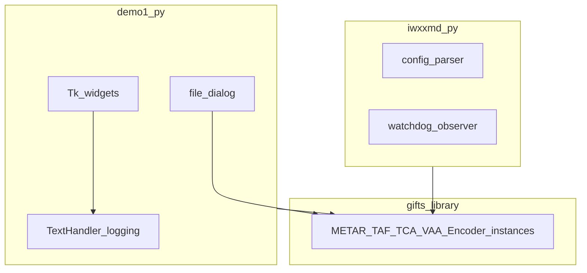
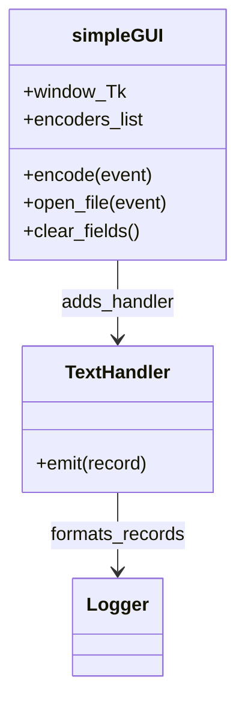

# `demo` directory modules

Applications that **drive** `gifts` encoders: a **Tk** GUI and a **watchdog** daemon. They are not installed as the `gifts` package itself but live alongside it in the monorepo.

## Component boundaries

## GUI vs library responsibilities

| Layer | Responsibility |
|-------|----------------|
| `simpleGUI` / Tk | File selection, user feedback, triggering encode |
| `gifts.*.Encoder` | AHL/TAC parsing, IWXXM generation |
| `Bulletin.write` | Meteorological bulletin file on disk |

## User journey (cross-link)

The operator-facing steps are diagrammed in [Demo GUI workflow](../workflows/demo-gui).

## Class sketch (GUI)

## Related

- [iwxxmd daemon workflow](../workflows/iwxxmd-daemon)
- [demo/README](https://github.com/josephmcguire-cpu/GIFTs-RUST/blob/main/demo/README.md)
