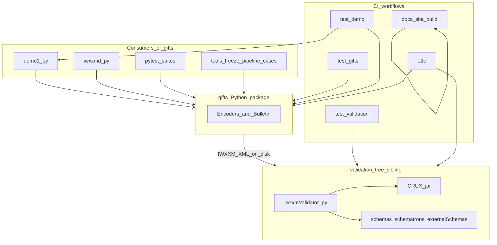
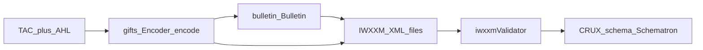
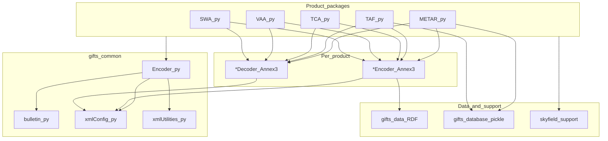
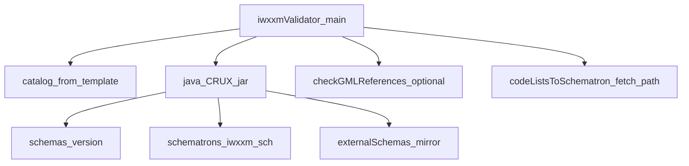
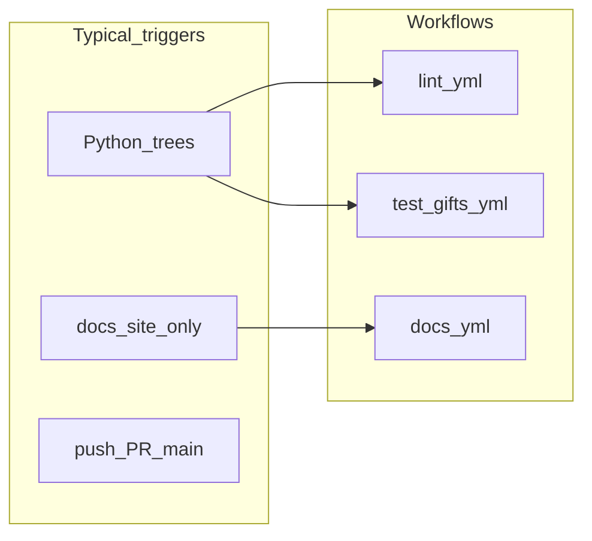

# Dependency graphs

How **logical services**, **artifacts**, and **key modules** depend on each other across the monorepo. `validation/` is a **sibling tree** to `gifts/`; it is **not** a Python dependency of the `gifts` package in [`pyproject.toml`](https://github.com/josephmcguire-cpu/GIFTs-RUST/blob/main/pyproject.toml).

## Logical services and consumers

Notes:

- **Tests** import `gifts` and sometimes invoke `validation/` scripts as subprocesses or skip when Java/schemas are missing.
- **e2e** ties **encode → files → `iwxxmValidator`** (see [E2E workflow](../workflows/e2e)).

## Artifact and data flow

Optional paths:

- **Pipeline goldens** — replay TAC with fixed time/UUID → compare to `testdata/pipeline/.../golden/` (see [Pipeline goldens](../testing/pipeline-goldens)).
- **E2e** — same idea with real validator invocation when the environment provides Java + layout under `validation/`.

## gifts module stack (direction of use)

| Layer | Depends on |
|-------|------------|
| Product `Encoder` | `common.Encoder`, `re_AHL` / `re_TAC`, `*Decoder`, `*Encoder`, optional `geoLocationsDB` |
| `common.Encoder` | `bulletin`, `xmlConfig`, `xmlUtilities`, `decoder`/`encoder` callables |
| IWXXM build | `xmlConfig` (site/IWXXM options), RDF under `gifts/data` where applicable |
| METAR/TAF | Pickled geo map via `gifts/database` |

## validation tool and filesystem stack

Run `iwxxmValidator.py` with **current working directory** = `validation/` so relative paths resolve (see [validation layout](../reference/validation-layout)).

| Component | Depends on |
|-----------|------------|
| `iwxxmValidator.py` | `bin/crux-1.3-all.jar`, `externalSchemas/`, generated `catalog-<ver>.xml`, `schemas/<ver>/`, `schematrons/<ver>/` |
| CRUX invocation | Catalog file, Schematron path, glob of `*.xml` in target directory |
| GML pass | `checkGMLReferences.py`; optional network if `-u` |
| `-f` / missing schema path | `codeListsToSchematron.py` and downloads per [validation README](https://github.com/josephmcguire-cpu/GIFTs-RUST/blob/main/validation/README.md) |

## CI and docs isolation

The **docs** workflow builds only [`docs-site/`](../reference/repository-layout) and does not need the `gifts` Python package.

## See also

- [Repository layout](../reference/repository-layout) — directory map
- [Repository overview](./overview) — narrative component view
- [gifts modules](./gifts-modules) — package diagram
- [gifts products](./gifts-products) — per-product wiring
- [Docker](../reference/docker) — image boundaries vs this graph
