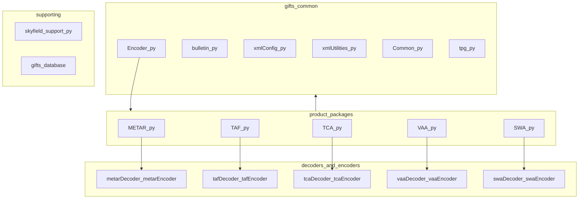
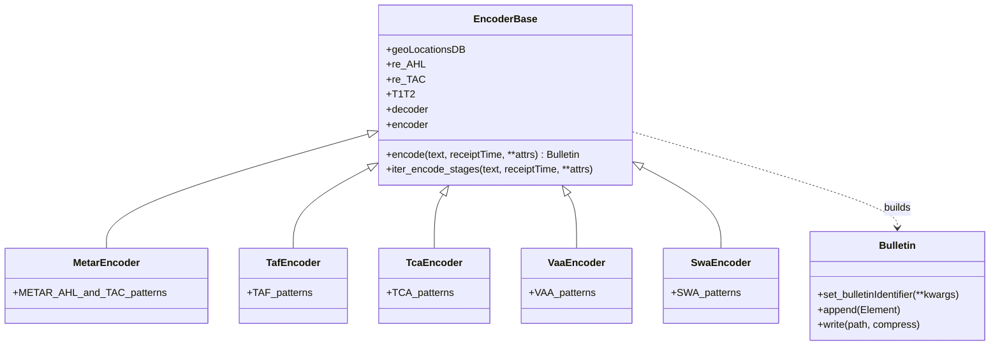

# `gifts` package modules

## Package and file map

## Encoder class pattern

Each product defines **`class Encoder(E.Encoder)`** with:

- `re_AHL`, `re_TAC`, `T1T2`
- `decoder` — typically `Annex3()` instance from `*Decoder`
- `encoder` — typically `Annex3()` from `*Encoder`
- `geoLocationsDB` where aerodrome metadata is required (METAR/TAF)

## Product family (compact)

Non-METAR products follow the **same abstract pipeline** as METAR (AHL → bulletin id → TAC iterations → decode → encode) with **different** regexes, decoders, and encoders. See [METAR pipeline](./metar-pipeline) for the fully expanded example and [gifts products](./gifts-products) for TAF/TCA/VAA/SWA wiring.

## See also

- [Dependency graphs](./dependency-graphs) — full `gifts` stack in context
