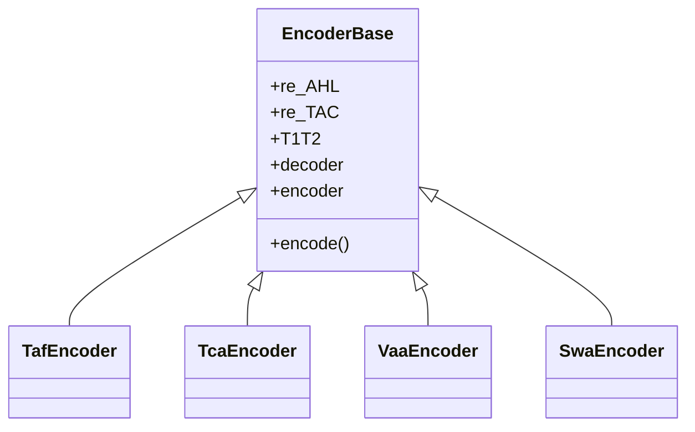

# `gifts` product family (TAF, TCA, VAA, SWA)

All aviation products follow the same **Encoder** pattern as [METAR](./metar-pipeline): WMO AHL + TAC regexes, `decoder(tac)` → dict, `encoder(dict, tac)` → IWXXM `Element`. AHL/TAC shapes are summarized in [demo/README](https://github.com/josephmcguire-cpu/GIFTs-RUST/blob/main/demo/README.md).

## Module wiring

| Product | Package module | Decoder | Encoder | `T1T2` (bulletin id) | Geo DB |
|---------|----------------|---------|---------|----------------------|--------|
| METAR/SPECI | `gifts.METAR` | `metarDecoder.Annex3` | `metarEncoder.Annex3` | `L` | Required |
| TAF | `gifts.TAF` | `tafDecoder.Annex3` | `tafEncoder.Annex3` | `L` | Required |
| Tropical cyclone | `gifts.TCA` | `tcaDecoder.Annex3` | `tcaEncoder.Annex3` | `LK` | No |
| Volcanic ash | `gifts.VAA` | `vaaDecoder.Annex3` | `vaaEncoder.Annex3` | `LU` | No |
| Space weather | `gifts.SWA` | `swaDecoder.Annex3` | `swaEncoder.Annex3` | `LN` | No |

`T1T2` feeds `attrs['tt']` in [`common/Encoder.py`](https://github.com/josephmcguire-cpu/GIFTs-RUST/blob/main/gifts/common/Encoder.py) for bulletin identification.

## Class pattern (condensed)

METAR uses the same base class (see [gifts modules](./gifts-modules)).

## Geo database (METAR/TAF only)

Constructors take **`geoLocationsDB`** with `.get(icao, default)` returning pipe-separated metadata (see [gifts/database README](https://github.com/josephmcguire-cpu/GIFTs-RUST/blob/main/gifts/database/README.md) and [`create_pickle_db.py`](https://github.com/josephmcguire-cpu/GIFTs-RUST/blob/main/gifts/database/create_pickle_db.py)).

## Code registry data (`gifts/data`)

RDF files under [`gifts/data/`](https://github.com/josephmcguire-cpu/GIFTs-RUST/tree/main/gifts/data) mirror WMO Code Registry containers used by decoders/encoders. They ship with the package (`package-data` in `pyproject.toml`). Paths are configured from [`xmlConfig`](../reference/xml-config).

## See also

- [Dependency graphs](./dependency-graphs) — full `gifts` stack
- [Library encode workflow](../workflows/library-encode)
