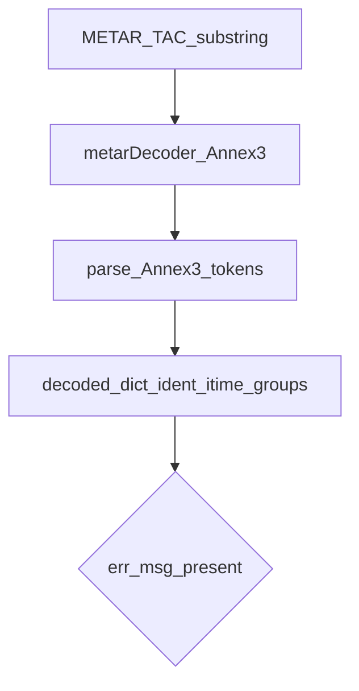
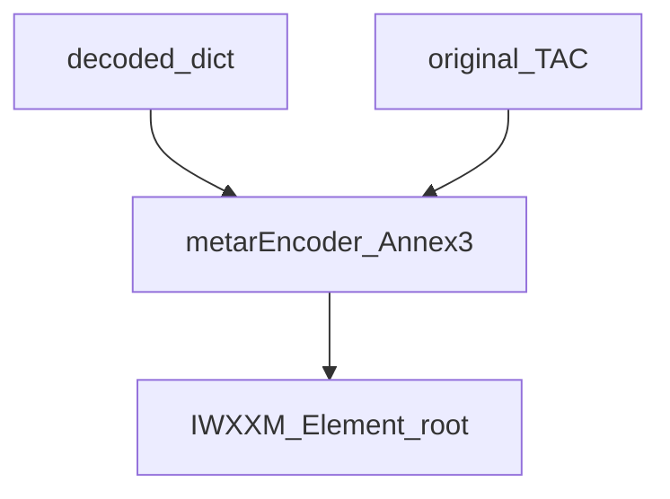
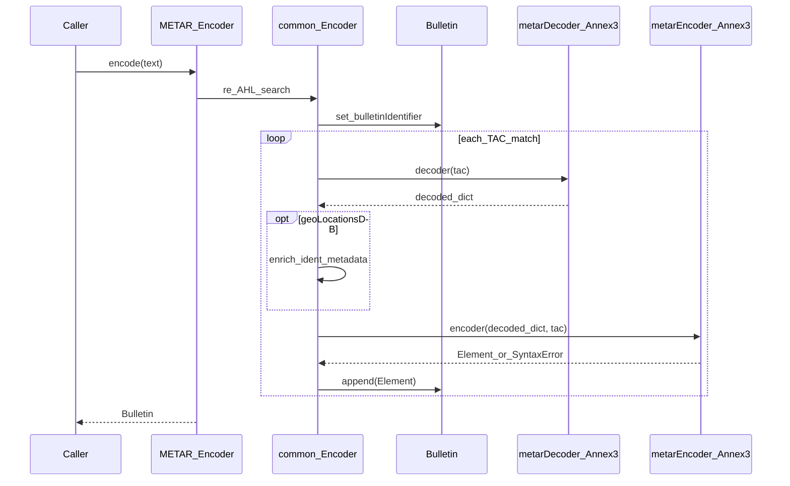

# METAR decode and encode pipeline

Worked example for **METAR/SPECI**: `gifts.METAR.Encoder` wires **`metarDecoder.Annex3`** and **`metarEncoder.Annex3`** through `gifts.common.Encoder.Encoder`.

## Conceptual decode pipeline

The decoder turns a **TAC substring** into a **nested dict** (groups such as `ident`, `itime`, `wind`, `vsby`, trends, etc.). On failure it may attach **`err_msg`**; the base encoder may skip IWXXM generation when `TRANSLATOR` is false.

## Conceptual encode pipeline

The encoder consumes the **decoded dict** and original **TAC string** to emit an **`xml.etree.ElementTree.Element`** IWXXM root.

## Sequence: `METAR.Encoder.encode`

## Related

- [Library encode workflow](../workflows/library-encode)
- Source: `gifts/METAR.py`, `gifts/metarDecoder.py`, `gifts/metarEncoder.py`, `gifts/common/Encoder.py`
