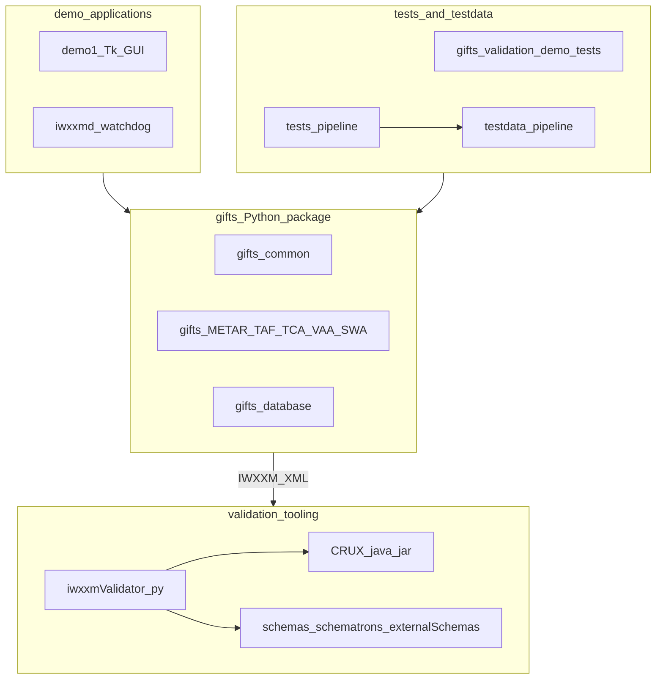
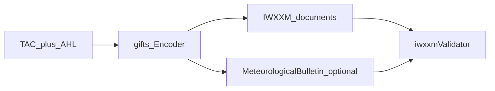

# Repository overview

High-level map of the monorepo: **installable library**, **applications**, **validation tooling**, and **tests/assets**.

## Component diagram

## Typical artifact flow

## Directory roles

| Path | Role |
|------|------|
| `gifts/` | TAC decoders/encoders, `common/`, package data RDF |
| `demo/` | GUI and daemon entrypoints |
| `validation/` | Validator CLI, CRUX, schemas, Schematron, external schemas |
| `tests/` | Cross-cutting pytest suites |
| `testdata/` | Frozen pipeline cases and golden XML |

## See also

- [Dependency graphs](./dependency-graphs) — services, artifacts, `gifts` and `validation` stacks
- [Repository layout](../reference/repository-layout) — top-level directory map with links to READMEs
