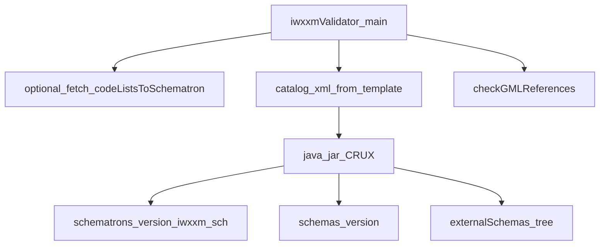
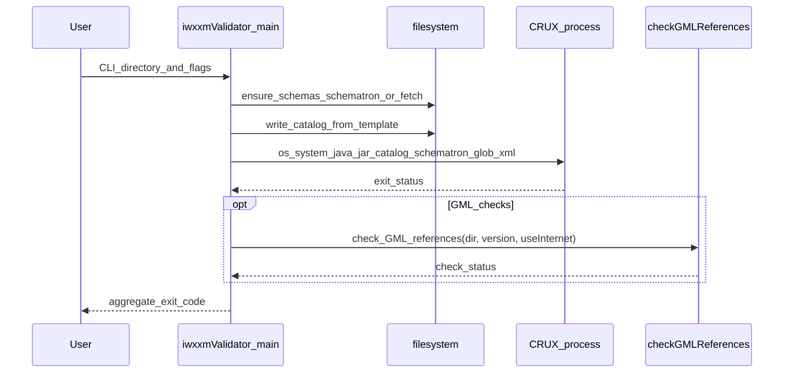

# `validation` directory modules

Python modules support **IWXXM XML** validation; **CRUX** (Java) performs schema and Schematron evaluation. The validator is **not** a TAC parser.

## Component diagram

## Sequence: validate directory

## Module roles

| Module | Role |
|--------|------|
| `iwxxmValidator.py` | CLI entry; orchestrates catalog, CRUX, GML pass |
| `checkGMLReferences.py` | GML / registry-oriented checks |
| `codeListsToSchematron.py` | Tooling to refresh codelist / Schematron-related artifacts when fetching |

## Related

- [Validation workflow](../workflows/validation)
- [validation/README](https://github.com/josephmcguire-cpu/GIFTs-RUST/blob/main/validation/README.md)
