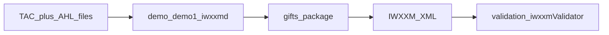

# GIFTs documentation

This site holds **planning-style** material for the GIFTs monorepo: technical requirements, use cases, workflows, and **Mermaid** architecture diagrams. It does not replace the canonical READMEs in the repository.

## Canonical sources

- [Root README](https://github.com/josephmcguire-cpu/GIFTs-RUST/blob/main/README.md) — project overview, installation, `Bulletin`, validation pointer
- [demo/README](https://github.com/josephmcguire-cpu/GIFTs-RUST/blob/main/demo/README.md) — `demo1.py` GUI, `iwxxmd.py` daemon, AHL/TAC regex expectations
- [validation/README](https://github.com/josephmcguire-cpu/GIFTs-RUST/blob/main/validation/README.md) — `iwxxmValidator.py`, CRUX, schemas, Schematron

## Where to start

| Audience | Start here |
|----------|------------|
| Integrators / ops | [Technical requirements](./trd), [Library encode workflow](./workflows/library-encode) |
| Demo users | [Demo GUI workflow](./workflows/demo-gui), [Demo architecture](./architecture/demo-modules) |
| IWXXM QA | [Validation workflow](./workflows/validation), [Validation architecture](./architecture/validation-modules) |
| Developers | [Repository map](./reference/repository-layout), [Dependency graphs](./architecture/dependency-graphs), [Repository overview](./architecture/overview), [gifts modules](./architecture/gifts-modules), [METAR pipeline](./architecture/metar-pipeline) |
| CI / packaging | [CI workflows](./reference/ci-workflows), [Docker](./reference/docker), [Python package](./reference/python-package) |
| Contributors | [Contributing](./contributing), [Testing overview](./testing/overview) |

## High-level system context

