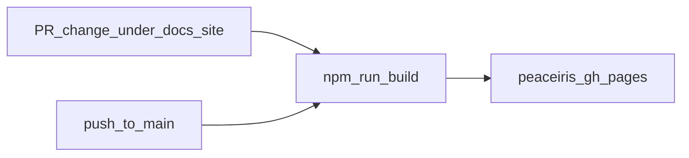

# GitHub Actions workflows

All workflows live under [`.github/workflows/`](https://github.com/josephmcguire-cpu/GIFTs-RUST/tree/main/.github/workflows). Triggers use **`main`** / **`master`** where noted.

| Workflow | Trigger | Purpose |
|----------|---------|---------|
| [`lint.yml`](https://github.com/josephmcguire-cpu/GIFTs-RUST/blob/main/.github/workflows/lint.yml) | push/PR to `main`/`master` | Ruff check + format on test trees and selected scripts (`continue-on-error` until repo-wide cleanup) |
| [`test-gifts.yml`](https://github.com/josephmcguire-cpu/GIFTs-RUST/blob/main/.github/workflows/test-gifts.yml) | push/PR | `pytest gifts/tests` with coverage gate; `tests/pipeline` |
| [`test-validation.yml`](https://github.com/josephmcguire-cpu/GIFTs-RUST/blob/main/.github/workflows/test-validation.yml) | push/PR | `pytest validation/tests` with coverage gate |
| [`test-demo.yml`](https://github.com/josephmcguire-cpu/GIFTs-RUST/blob/main/.github/workflows/test-demo.yml) | push/PR | `pytest demo/tests` with coverage gate |
| [`e2e.yml`](https://github.com/josephmcguire-cpu/GIFTs-RUST/blob/main/.github/workflows/e2e.yml) | push/PR | Python 3.11 + Java 17; `pytest tests/e2e -m e2e` |
| [`perf.yml`](https://github.com/josephmcguire-cpu/GIFTs-RUST/blob/main/.github/workflows/perf.yml) | `workflow_dispatch`, weekly cron | `pytest tests/perf -m perf` |
| [`docker-smoke.yml`](https://github.com/josephmcguire-cpu/GIFTs-RUST/blob/main/.github/workflows/docker-smoke.yml) | push/PR | `docker compose build` |
| [`docs.yml`](https://github.com/josephmcguire-cpu/GIFTs-RUST/blob/main/.github/workflows/docs.yml) | PR/push when `docs-site/` or workflow changes | `npm install`/`ci` + Docusaurus build; deploy to `gh-pages` on **`main`** push |

## Docs workflow: PR vs deploy

Pull requests only **build** (no deploy). Pushes to **`main`** that touch `docs-site/` **build and deploy** the static site.

## See also

- [Docker](./docker) — images exercised by `docker-smoke`
- [Testing overview](../testing/overview)
