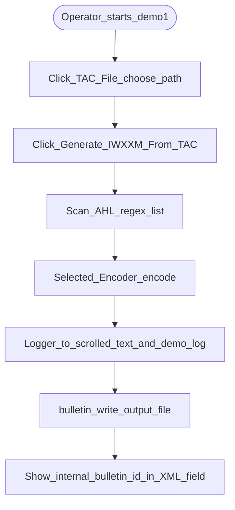
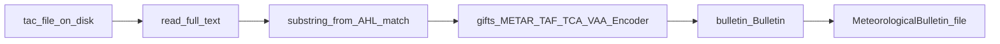

# Demo GUI workflow (`demo1.py`)

`demo1.py` is a **Tkinter** demonstrator: pick a TAC file, run the matching GIFTs encoder, show **activity messages**, and write a **Meteorological Bulletin** beside the demo.

## User journey

## Data flow (same scenario, artifact view)

## Notes

- **Geo database**: unpickles `aerodromes.db` (Unix-like) or `aerodromes.win.db` (Windows) before building encoders that need it.
- **Encoder selection**: ordered list of `(regexp, Encoder)`; first AHL match wins (`demo1.py`).
- **Logging**: `logging` goes to **`demo.log`** and to the **Activity Msgs** `ScrolledText` via a custom `TextHandler`.
- **Output name**: `bulletin.write()` uses internal bulletin id (see `Bulletin` implementation); the GUI displays `bulletin._internalBulletinId` in the **IWXXM XML File** field.

See [Demo modules](../architecture/demo-modules) for component boundaries.
