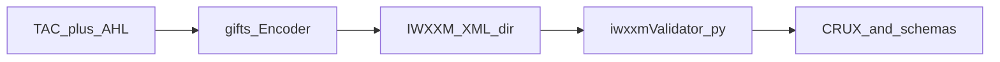

# E2E: encode → XML on disk → IWXXM validation

End-to-end tests exercise the **full chain**: TAC (+ AHL) through **`gifts`** encoders, **write XML to disk**, then run **`validation/iwxxmValidator.py`** against that directory. They depend on **Python**, a **Java** runtime, and a correctly laid out **`validation/`** tree (CRUX JAR, `externalSchemas/`, schema + Schematron for the IWXXM version under test).

## Dependency chain

This matches the **artifact flow** on [Dependency graphs](../architecture/dependency-graphs): `validation/` does **not** import `gifts`; it consumes **files** the tests produce.

## Where it lives

- Pytest tree: [`tests/e2e/`](https://github.com/josephmcguire-cpu/GIFTs-RUST/tree/main/tests/e2e)
- Marker: **`e2e`** (see [Testing overview](../testing/overview))
- CI: [e2e workflow](https://github.com/josephmcguire-cpu/GIFTs-RUST/blob/main/.github/workflows/e2e.yml) (Python 3.11 + Java 17)
- Docker: `docker compose --profile e2e run --rm e2e` (see [Docker reference](../reference/docker))

Tests may **skip** when Java or schema layout is unavailable — check suite output and fixture docstrings in `tests/e2e`.

## See also

- [Validation workflow](./validation) — how to run `iwxxmValidator.py` manually
- [Validation layout](../reference/validation-layout) — `validation/` directory roles
- [CI workflows](../reference/ci-workflows)
