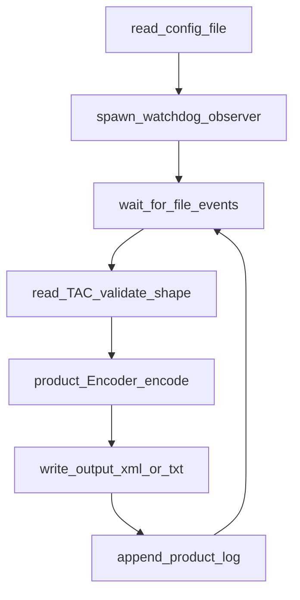
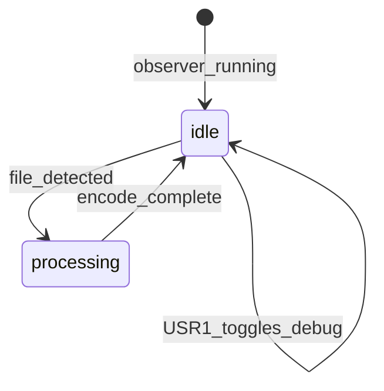

# `iwxxmd` daemon workflow

`demo/iwxxmd.py` watches an **input** directory with **watchdog**, encodes arriving TAC files with a configured product encoder, and writes results to an **output** directory. Logging rotates by day-of-week (`demo/README`).

## Process flow

## Operator signals

- **`kill -USR1 <pid>`** toggles DEBUG logging (`demo/README`).

## Optional state view

## Related docs

- [Demo modules](../architecture/demo-modules)
- Canonical behavior: [demo/README](https://github.com/josephmcguire-cpu/GIFTs-RUST/blob/main/demo/README.md)
