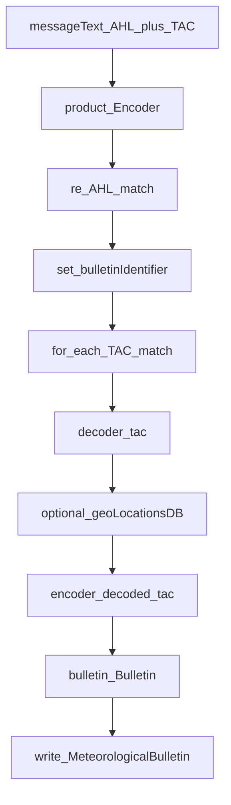

# Library encode workflow

End-to-end data flow when using the **`gifts`** package programmatically (any product encoder: METAR, TAF, TCA, VAA, SWA).

## Steps

1. Build **full message text**: WMO AHL line + TAC body (and further TACs if the product regex allows multiples).
2. Instantiate the product **`Encoder`** (e.g. `gifts.METAR.Encoder(geoLocationsDB)`).
3. Call **`encode(text, receiptTime=None, **attrs)`**:
   - Parses AHL via `re_AHL`; on failure, returns an **empty** `Bulletin`.
   - Sets bulletin identifier from AHL groups + product `T1T2`.
   - For each TAC match from `re_TAC`: **decode** → optional geo enrichment → **encode** to IWXXM `Element`; append successes to the bulletin.
4. Consume **`Bulletin`**: iterate XML roots, inspect, or call **`write()`** / **`write(compress=True)`**.

## Data flow

## Related architecture

- [gifts modules](../architecture/gifts-modules) — module layout and `Encoder` hierarchy.
- [METAR pipeline](../architecture/metar-pipeline) — detailed METAR decode/encode chain.
