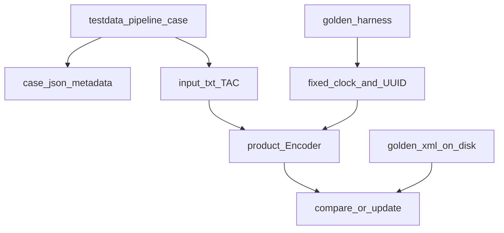

# Pipeline golden test workflow

`tests/pipeline` replays committed **TAC** inputs under `testdata/pipeline/<case>/`, runs the same encode path with **deterministic** time and UUID mocks, and compares XML (and optional stages) to **golden** files.

## Flow

## Maintainer notes

- Regenerate goldens with the repository tooling when encoders intentionally change (`tools/freeze_pipeline_cases.py`; see `testdata/README.md`).
- Some tests may invoke **`iwxxmValidator.py`** when Java and schema trees are present (integration marker).

## Related docs

- [Repository overview](../architecture/overview)
- [Pipeline goldens (testing)](../testing/pipeline-goldens) — `case.json`, harness, freeze tool
- [tests/README](https://github.com/josephmcguire-cpu/GIFTs-RUST/blob/main/tests/README.md)
- [testdata/README](https://github.com/josephmcguire-cpu/GIFTs-RUST/blob/main/testdata/README.md)
