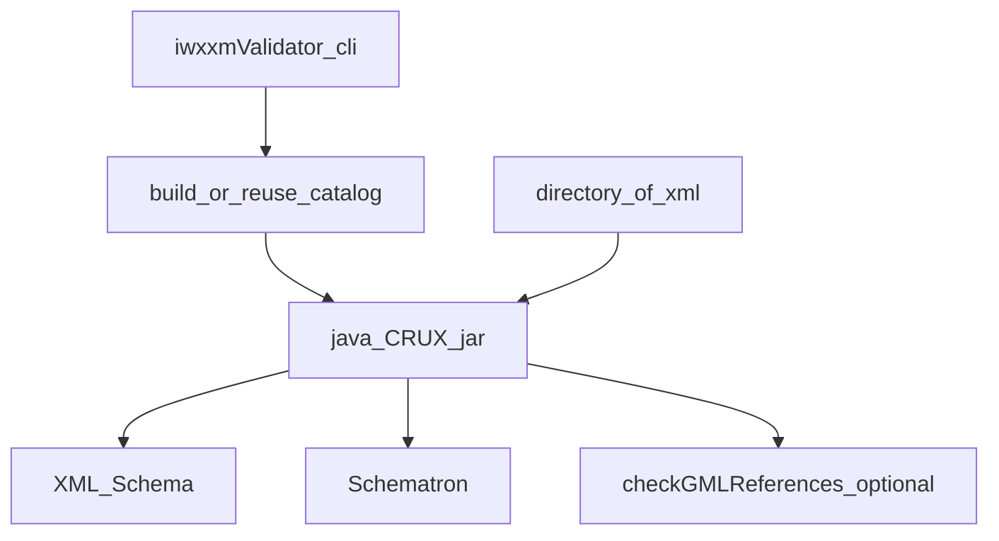

# IWXXM validation workflow

Validation is **offline**: a directory of **IWXXM `.xml`** files is checked with **XML Schema**, **Schematron**, and optionally **GML** reference rules. It does not parse raw TAC.

## Steps

1. `cd` to **`validation/`** (script expects `bin/crux-1.3-all.jar` and `externalSchemas/` there).
2. Ensure `schemas/<version>/iwxxm.xsd` and `schematrons/<version>/iwxxm.sch` exist (or run with **`-f` / `--fetch`** to pull artifacts).
3. Run **`python iwxxmValidator.py [flags] <directory>`**.
4. Interpret console result: CRUX exit status plus optional GML check output.

## Common CLI flags (`iwxxmValidator.py`)

| Flag | Long form | Role |
|------|-----------|------|
| `-f` | `--fetch` | Pull / refresh artifacts from WMO Code Registry and WMO schema site (see validation README) |
| `-u` | `--useInternet` | When running GML checks, query the WMO Code Registry over the network |
| | `--noGMLChecks` | Skip the GML / link-check pass |
| `-k` | `--keep` | Keep the generated OASIS **`catalog-<version>.xml`** after validation |
| `-v` | `--version` | IWXXM **major.minor** directory under `schemas/` and `schematrons/` (default **`2023-1`**; align with [`xmlConfig`](../reference/xml-config) / `IWXXM_VALIDATOR_VERSION`) |
| *(positional)* | `directory` | Folder containing **IWXXM `.xml`** files to validate |

## Data flow

## Related architecture

- [Validation modules](../architecture/validation-modules)
- [Validation layout](../reference/validation-layout) — `bin/`, `schemas/`, `schematrons/`, `externalSchemas/`
- [E2E workflow](./e2e) — tests that chain encode → this validator
- [validation/README](https://github.com/josephmcguire-cpu/GIFTs-RUST/blob/main/validation/README.md)
